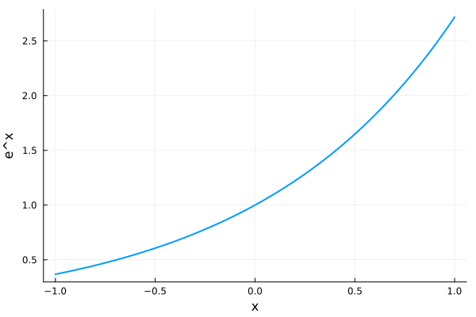

## **Title**: &lt;Title Content&gt;

**Author:** &lt;Author Content&gt;

**University:** &lt;University Content&gt;

**Department:** &lt;Department Content&gt;

**Advisor:** &lt;Advisor Content&gt;

**Date:** &lt;Date Content&gt;

## **Abstract**

&lt;Abstract Content&gt;

## **Acknowledgments**

&lt;Acknowledgments Content&gt;

## **Table of Contents**

-   [1 &lt;Chapter Title 1&gt;](#chapter-chapter-title-1)
    -   [1.1 &lt;Section Title 1&gt;](#section-section-title-1)
        -   [1.1.1 &lt;Theorem Title 1&gt;](#theorem-theorem-title-1)
        -   [1.1.2 &lt;Definition Title 1&gt;](#definition-definition-title-1)
        -   [1.1.3 &lt;Figure Title 1&gt;](#figure-figure-title-1)
    -   [&lt;Section Title 2&gt;](#section-section-title-2)
        -   [&lt;Theorem Title 2&gt;](#theorem-theorem-title-2)
        -   [&lt;Definition Title 2&gt;](#definition-definition-title-2)
        -   [&lt;Figure Title 2&gt;](#figure-figure-title-2)
-   [Proofs](#proofs)
-   [References](#references)

## **Chapter 1**: &lt;Chapter Title 1&gt;

&lt;Chapter Content 1&gt;

## **Section 1.1**: &lt;Section Title 1&gt;

&lt;Section Content 1&gt;

**Theorem 1.1.1** (&lt;Theorem Title 1&gt;)**.** &lt;Theorem Statement 1&gt;

**Proof**. See [Proof of &lt;Theorem Title 1&gt;](#proof-of-theorem-title-1).

**Definition 1.1.2** (&lt;Definition Title 1&gt;)**.** &lt;Definition Statement 1&gt;

<strong>Figure 1.1.3</strong> (&lt;Figure Title 1&gt;)<strong>.</strong> &lt;Figure Caption 1&gt;

Test Hyper-References: [&lt;Theorem Title 1&gt;](#theorem-theorem-title-1) [&lt;Definition Title 1&gt;](#definition-definition-title-1) [&lt;Figure Title 1&gt;](#figure-figure-title-1)

## **Section**: &lt;Section Title 2&gt;

&lt;Section Content 2&gt;

**Theorem** (&lt;Theorem Title 2&gt;)**.** &lt;Theorem Statement 2&gt;

**Proof**. See [Proof of &lt;Theorem Title 2&gt;](#proof-of-theorem-title-2).

**Definition** (&lt;Definition Title 2&gt;)**.** &lt;Definition Statement 2&gt;

<strong>Figure</strong> (&lt;Figure Title 2&gt;)<strong>.</strong> &lt;Figure Caption 2&gt;

Test Hyper-References: [&lt;Theorem Title 2&gt;](#theorem-theorem-title-2) [&lt;Definition Title 2&gt;](#definition-definition-title-2) [&lt;Figure Title 2&gt;](#figure-figure-title-2)

## **Section 1.2**: &lt;Section Title 3&gt;

&lt;Section Content 3&gt;

**Theorem 1.2.1** (&lt;Theorem Title 3&gt;)**.** &lt;Theorem Statement 3&gt;

**Proof**. See [Proof of &lt;Theorem Title 3&gt;](#proof-of-theorem-title-3).

**Definition 1.2.2** (&lt;Definition Title 3&gt;)**.** &lt;Definition Statement 3&gt;

<strong>Figure 1.2.3</strong> (&lt;Figure Title 3&gt;)<strong>.</strong> &lt;Figure Caption 3&gt;

Test Hyper-References: [&lt;Theorem Title 3&gt;](#theorem-theorem-title-3) [&lt;Definition Title 3&gt;](#definition-definition-title-3) [&lt;Figure Title 3&gt;](#figure-figure-title-3)

## **Section**: &lt;Section Title 4&gt;

&lt;Section Content 4&gt;

**Theorem** (&lt;Theorem Title 4&gt;)**.** &lt;Theorem Statement 4&gt;

**Proof**. See [Proof of &lt;Theorem Title 4&gt;](#proof-of-theorem-title-4).

**Definition** (&lt;Definition Title 4&gt;)**.** &lt;Definition Statement 4&gt;

<strong>Figure</strong> (&lt;Figure Title 4&gt;)<strong>.</strong> &lt;Figure Caption 4&gt;

Test Hyper-References: [&lt;Theorem Title 4&gt;](#theorem-theorem-title-4) [&lt;Definition Title 4&gt;](#definition-definition-title-4) [&lt;Figure Title 4&gt;](#figure-figure-title-4)  
Test References: \[[1](#ref-1970test), [2](#ref-2002test), [3](#ref-2013test), [4](#ref-2018test)\]  
Test Code Output: 1, 2, 3, 4, 5, 6, 7, 8, 9, 10

## **Proofs**

### Proof of [&lt;Theorem Title 1&gt;](#theorem-theorem-title-1)

&lt;Theorem Proof 1&gt;

### Proof of [&lt;Theorem Title 2&gt;](#theorem-theorem-title-2)

&lt;Theorem Proof 2&gt;

### Proof of [&lt;Theorem Title 3&gt;](#theorem-theorem-title-3)

&lt;Theorem Proof 3&gt;

### Proof of [&lt;Theorem Title 4&gt;](#theorem-theorem-title-4)

&lt;Theorem Proof 4&gt;

## **References**

<table role="presentation" width="100%" border="3" rules="all" frame="box" cellpadding="6" cellspacing="0" style="border:3px solid currentColor;border-collapse:collapse">
<tbody>
<tr>
<td width="48" align="center" valign="middle" style="border:1px solid currentColor" rowspan="6">[1]</td>
<td width="96" align="left" valign="top" nowrap style="border:1px solid currentColor"><strong>Date:</strong></td>
<td width="100%" align="left" valign="top" style="border:1px solid currentColor">&lt;Date&gt;</td>
</tr>
<tr>
<td width="96" align="left" valign="top" nowrap style="border:1px solid currentColor"><strong>Authors:</strong></td>
<td width="100%" align="left" valign="top" style="border:1px solid currentColor">&lt;Authors&gt;</td>
</tr>
<tr>
<td width="96" align="left" valign="top" nowrap style="border:1px solid currentColor"><strong>Title:</strong></td>
<td width="100%" align="left" valign="top" style="border:1px solid currentColor">&lt;Title&gt;</td>
</tr>
<tr>
<td width="96" align="left" valign="top" nowrap style="border:1px solid currentColor"><strong>Type:</strong></td>
<td width="100%" align="left" valign="top" style="border:1px solid currentColor">Paper</td>
</tr>
<tr>
<td width="96" align="left" valign="top" nowrap style="border:1px solid currentColor"><strong>Publisher:</strong></td>
<td width="100%" align="left" valign="top" style="border:1px solid currentColor">&lt;Publisher&gt;</td>
</tr>
<tr>
<td width="96" align="left" valign="top" nowrap style="border:1px solid currentColor"><strong>Location:</strong></td>
<td width="100%" align="left" valign="top" style="border:1px solid currentColor"><a href="https://www.google.com/search?q=test">https://www.google.com/search?q=test</a></td>
</tr>
</tbody>
</table>

<table role="presentation" width="100%" border="3" rules="all" frame="box" cellpadding="6" cellspacing="0" style="border:3px solid currentColor;border-collapse:collapse">
<tbody>
<tr>
<td width="48" align="center" valign="middle" style="border:1px solid currentColor" rowspan="6">[2]</td>
<td width="96" align="left" valign="top" nowrap style="border:1px solid currentColor"><strong>Date:</strong></td>
<td width="100%" align="left" valign="top" style="border:1px solid currentColor">&lt;Date&gt;</td>
</tr>
<tr>
<td width="96" align="left" valign="top" nowrap style="border:1px solid currentColor"><strong>Authors:</strong></td>
<td width="100%" align="left" valign="top" style="border:1px solid currentColor">&lt;Authors&gt;</td>
</tr>
<tr>
<td width="96" align="left" valign="top" nowrap style="border:1px solid currentColor"><strong>Title:</strong></td>
<td width="100%" align="left" valign="top" style="border:1px solid currentColor">&lt;Title&gt;</td>
</tr>
<tr>
<td width="96" align="left" valign="top" nowrap style="border:1px solid currentColor"><strong>Type:</strong></td>
<td width="100%" align="left" valign="top" style="border:1px solid currentColor">Book</td>
</tr>
<tr>
<td width="96" align="left" valign="top" nowrap style="border:1px solid currentColor"><strong>Publisher:</strong></td>
<td width="100%" align="left" valign="top" style="border:1px solid currentColor">&lt;Publisher&gt;</td>
</tr>
<tr>
<td width="96" align="left" valign="top" nowrap style="border:1px solid currentColor"><strong>Location:</strong></td>
<td width="100%" align="left" valign="top" style="border:1px solid currentColor"><a href="https://www.google.com/search?q=test">https://www.google.com/search?q=test</a></td>
</tr>
</tbody>
</table>

<table role="presentation" width="100%" border="3" rules="all" frame="box" cellpadding="6" cellspacing="0" style="border:3px solid currentColor;border-collapse:collapse">
<tbody>
<tr>
<td width="48" align="center" valign="middle" style="border:1px solid currentColor" rowspan="5">[3]</td>
<td width="96" align="left" valign="top" nowrap style="border:1px solid currentColor"><strong>Date:</strong></td>
<td width="100%" align="left" valign="top" style="border:1px solid currentColor">&lt;Date&gt;</td>
</tr>
<tr>
<td width="96" align="left" valign="top" nowrap style="border:1px solid currentColor"><strong>Authors:</strong></td>
<td width="100%" align="left" valign="top" style="border:1px solid currentColor">&lt;Authors&gt;</td>
</tr>
<tr>
<td width="96" align="left" valign="top" nowrap style="border:1px solid currentColor"><strong>Title:</strong></td>
<td width="100%" align="left" valign="top" style="border:1px solid currentColor">&lt;Title&gt;</td>
</tr>
<tr>
<td width="96" align="left" valign="top" nowrap style="border:1px solid currentColor"><strong>Type:</strong></td>
<td width="100%" align="left" valign="top" style="border:1px solid currentColor">Preprint</td>
</tr>
<tr>
<td width="96" align="left" valign="top" nowrap style="border:1px solid currentColor"><strong>Location:</strong></td>
<td width="100%" align="left" valign="top" style="border:1px solid currentColor"><a href="https://www.google.com/search?q=test">https://www.google.com/search?q=test</a></td>
</tr>
</tbody>
</table>

<table role="presentation" width="100%" border="3" rules="all" frame="box" cellpadding="6" cellspacing="0" style="border:3px solid currentColor;border-collapse:collapse">
<tbody>
<tr>
<td width="48" align="center" valign="middle" style="border:1px solid currentColor" rowspan="6">[4]</td>
<td width="96" align="left" valign="top" nowrap style="border:1px solid currentColor"><strong>Date:</strong></td>
<td width="100%" align="left" valign="top" style="border:1px solid currentColor">&lt;Date&gt;</td>
</tr>
<tr>
<td width="96" align="left" valign="top" nowrap style="border:1px solid currentColor"><strong>Authors:</strong></td>
<td width="100%" align="left" valign="top" style="border:1px solid currentColor">&lt;Authors&gt;</td>
</tr>
<tr>
<td width="96" align="left" valign="top" nowrap style="border:1px solid currentColor"><strong>Title:</strong></td>
<td width="100%" align="left" valign="top" style="border:1px solid currentColor">&lt;Title&gt;</td>
</tr>
<tr>
<td width="96" align="left" valign="top" nowrap style="border:1px solid currentColor"><strong>Type:</strong></td>
<td width="100%" align="left" valign="top" style="border:1px solid currentColor">Ph.D. Thesis</td>
</tr>
<tr>
<td width="96" align="left" valign="top" nowrap style="border:1px solid currentColor"><strong>School:</strong></td>
<td width="100%" align="left" valign="top" style="border:1px solid currentColor">&lt;School&gt;</td>
</tr>
<tr>
<td width="96" align="left" valign="top" nowrap style="border:1px solid currentColor"><strong>Location:</strong></td>
<td width="100%" align="left" valign="top" style="border:1px solid currentColor"><a href="https://www.google.com/search?q=test">https://www.google.com/search?q=test</a></td>
</tr>
</tbody>
</table>
