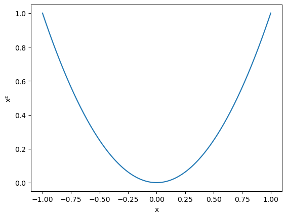

## \<Title Content\>

**Authors:** \<Author Content 1\>1 and \<Author Content 2\>1

**Affiliations:** 1\<Affiliation Content\>

**Date:** \<Date\>

## Contents

- [1 \<Section Title 1\>](#chapter-section-title-1)
- [2 \<Section Title 2\>](#chapter-section-title-2)
- [3 \<Section Title 3\>](#chapter-section-title-3)
- [Proofs](#proofs)
- [References](#references)

## 1 \<Section Title 1\>

- [1.1 \<Subsection Title 1\>](#section-subsection-title-1)
- [1.2 \<Subsection Title 2\>](#section-subsection-title-2)

\<Section Content 1\>

### 1.1 \<Subsection Title 1\>

- [1.1.1 Theorem: \<Theorem Title 1\>](#theorem-theorem-title-1)
- [1.1.2 Definition: \<Definition Title 1\>](#definition-definition-title-1)
- [1.1.3 Figure: \<Figure Title 1\>](#figure-figure-title-1)

\<Subsection Content 1\>

**Theorem 1.1.1** (\<Theorem Title 1\>)**.** \<Theorem Statement 1\>

**Proof**. See [Proof of \<Theorem Title 1\>](#proof-of-theorem-title-1).

**Definition 1.1.2** (\<Definition Title 1\>)**.** \<Definition Statement 1\>

<strong>Figure 1.1.3</strong> (&lt;Figure Title 1&gt;)<strong>.</strong> &lt;Figure Caption 1&gt;

Test Hyper-References: [\<Theorem Title 1\>](#theorem-theorem-title-1) [\<Definition Title 1\>](#definition-definition-title-1) [\<Figure Title 1\>](#figure-figure-title-1)

Test References: \[[1](#ref-1970test), [2](#ref-2002test), [3](#ref-2013test), [4](#ref-2018test)\]

Test Code Output: 1, 2, 3, 4, 5, 6, 7, 8, 9, 10

### 1.2 \<Subsection Title 2\>

\<Subsection Content 2\>

**Theorem** (\<Theorem Title 2\>)**.** \<Theorem Statement 2\>

**Proof**. See [Proof of \<Theorem Title 2\>](#proof-of-theorem-title-2).

**Definition** (\<Definition Title 2\>)**.** \<Definition Statement 2\>

<strong>Figure</strong> (&lt;Figure Title 2&gt;)<strong>.</strong> &lt;Figure Caption 2&gt;

Test Hyper-References: [\<Theorem Title 2\>](#theorem-theorem-title-2) [\<Definition Title 2\>](#definition-definition-title-2) [\<Figure Title 2\>](#figure-figure-title-2)

Test References: \[[1](#ref-1970test), [2](#ref-2002test), [3](#ref-2013test), [4](#ref-2018test)\]

Test Code Output: 1, 2, 3, 4, 5, 6, 7, 8, 9, 10

## 2 \<Section Title 2\>

- [2.1 \<Subsection Title 3\>](#section-subsection-title-3)
- [2.2 \<Subsection Title 4\>](#section-subsection-title-4)

### 2.1 \<Subsection Title 3\>

\<Subsection Content 3\>

### 2.2 \<Subsection Title 4\>

\<Subsection Content 4\>

## 3 \<Section Title 3\>

- [3.1 Theorem: \<Theorem Title 3\>](#theorem-theorem-title-3)
- [3.2 Definition: \<Definition Title 3\>](#definition-definition-title-3)
- [3.3 Figure: \<Figure Title 3\>](#figure-figure-title-3)

**Theorem 3.1** (\<Theorem Title 3\>)**.** \<Theorem Statement 3\>

**Proof**. See [Proof of \<Theorem Title 3\>](#proof-of-theorem-title-3).

**Definition 3.2** (\<Definition Title 3\>)**.** \<Definition Statement 3\>

<strong>Figure 3.3</strong> (&lt;Figure Title 3&gt;)<strong>.</strong> &lt;Figure Caption 3&gt;

## Proofs

### Proof of [\<Theorem Title 1\>](#theorem-theorem-title-1)

\<Theorem Proof 1\>

### Proof of [\<Theorem Title 2\>](#theorem-theorem-title-2)

\<Theorem Proof 2\>

### Proof of [\<Theorem Title 3\>](#theorem-theorem-title-3)

\<Theorem Proof 3\>

## References

\[1\] (Paper) \<Authors\>, *\<Title\>*, \<Journal Abbreviation\>, 1 (1970), pp. 1–10.

\[2\] (Book) \<Authors\>, *\<Title\>*, \<Publisher\>, \<Publisher Location\>, 2002.

\[3\] (Preprint) \<Authors\>, *\<Title\>*, 2013, <https://www.google.com/search?q=test>.

\[4\] (Thesis) \<Authors\>, *\<Title\>*, PhD thesis, \<School\>, \<School Location\>, 2018.

